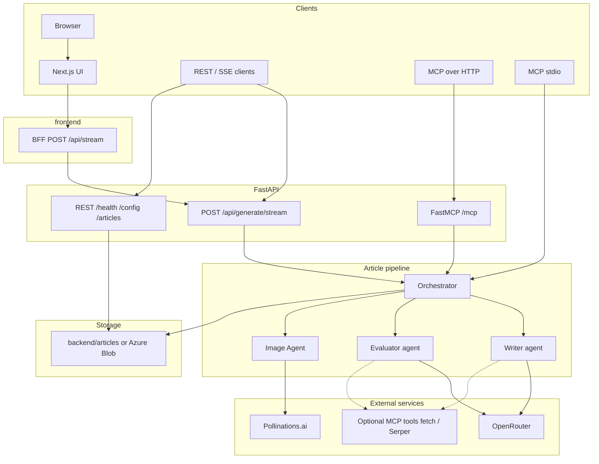

# Swift — Technical Writer AI Platform

Swift is a multi-agent article generation platform. An **Orchestrator**
coordinates a **Writer ↔ Evaluator** loop until the draft scores highly
enough, then hands the approved article to an **Image Agent** which
fills in illustrations via [Pollinations.ai](https://pollinations.ai).

- **Backend**: FastAPI + OpenAI Agents SDK (routed through OpenRouter)
- **Streaming**: Server-Sent Events
- **MCP**: FastMCP server exposing Swift's tools to MCP clients
- **Frontend**: Next.js 15 (App Router) + Tailwind; live SSE via `app/api/stream` BFF
- **Storage**: local `backend/articles/` in dev; **Azure Blob** when `AZURE_STORAGE_CONNECTION_STRING` is set (Terraform provisions the account + container)

## Architecture

Swift exposes the same **article pipeline** everywhere: a deterministic Python **Orchestrator** runs the **Writer** and **Evaluator** agents (via OpenRouter) in a loop until the draft passes or retries are exhausted, then runs the **Image Agent** (Pollinations URLs for `[IMAGE: …]`, Mermaid diagrams surfaced separately). **FastAPI** serves REST (health, config, article files), **SSE** (`POST /api/generate/stream`), and optional **MCP HTTP** (`/mcp`). **Next.js** proxies browser SSE through `POST /api/stream`. A separate **MCP stdio** process uses the same FastMCP tool registry without going through HTTP.



### Running the application

This README does not spell out install or dev-server commands (Python/`uv`, Node, Docker). Configure environment from `.env.example` at the repo root and `frontend/.env.local.example` for the UI; run the FastAPI app from `backend.main:app`, the Next.js app under `frontend/`, or use `docker-compose.yml` / `terraform/` for containers and Azure—see `terraform/README.md` for cloud inputs.

## Using Swift as an MCP server

Swift exposes its article-generation pipeline as a standard
[MCP](https://modelcontextprotocol.io) tool, so any MCP client
(Claude Desktop, Cursor, other agents) can invoke `write_article`
directly. Two transports are supported; they share the same tool
registry.

### HTTP (Streamable-HTTP) — cloud & networked clients

Mounted into the FastAPI app at `SWIFT_MCP_SERVER_MOUNT_PATH`
(default `/mcp`). When the API is running locally, the endpoint is at
<http://localhost:8000/mcp/>. Set
`SWIFT_MCP_SERVER_BEARER_TOKEN` for public deployments — every
request under the mount path then needs
`Authorization: Bearer <token>`; the REST endpoints (`/`, `/health`,
`/config`) stay open. Disable the surface entirely with
`SWIFT_MCP_SERVER_ENABLED=false`.

### Stdio — local clients (Claude Desktop, `mcp` CLI)

```bash
uv run python -m backend.mcp.server
```

The process speaks MCP JSON-RPC over stdin/stdout; the bearer-token
setting is ignored (the OS process boundary is the trust boundary).
For Claude Desktop, add an entry to its config file:

```json
{
  "mcpServers": {
    "swift-writer": {
      "command": "uv",
      "args": ["run", "python", "-m", "backend.mcp.server"],
      "cwd": "/absolute/path/to/swift-writer"
    }
  }
}
```

### Calling the tool

One tool is advertised: `write_article(topic, tone?, length?,
keywords?, audience?, extra_notes?, max_retries?)`. Only `topic` is
required; everything else falls back to the same defaults as
`ArticleBrief`. The return value is the full `FinalArticle`
(Markdown body with images substituted + structured diagram index).

## Streaming the pipeline to a browser

Human callers don't want a 60-second blank tab while the Orchestrator
drafts, grades, and revises. `POST /api/generate/stream` opens a
Server-Sent Events connection and emits a typed event for every
pipeline transition:

| Event                  | When                                  | Useful for                      |
| ---------------------- | ------------------------------------- | ------------------------------- |
| `run.started`          | Brief accepted                        | Show "working on it…"           |
| `attempt.started`      | Revision iteration begins             | "Attempt N of M" label          |
| `writer.completed`     | Draft ready for this iteration        | Reveal title, word count        |
| `evaluator.completed`  | Feedback ready                        | Show score, strengths/weaknesses |
| `images.started`       | Image Agent begins substitution       | Progress indicator              |
| `images.completed`     | Images + diagrams counted             | Confirm illustrations landed    |
| `run.completed`        | Terminal — full `FinalArticle`        | Render the article              |
| `run.failed`           | Terminal — pipeline raised            | Show error, close the spinner   |

### Curl

```bash
curl -N -X POST http://localhost:8000/api/generate/stream \
  -H 'Content-Type: application/json' \
  -d '{"brief":{"topic":"Redis vs Memcached","length":"short"},"max_retries":1}'
```

The `-N` (no-buffer) flag is important — curl otherwise waits for
the whole body. Each frame is `event: <type>\ndata: <json>\n\n`.

### Browser (fetch + ReadableStream)

```ts
const response = await fetch("/api/generate/stream", {
  method: "POST",
  headers: { "Content-Type": "application/json" },
  body: JSON.stringify({
    brief: { topic: "Redis vs Memcached", length: "short" },
    max_retries: 1,
  }),
});

const reader = response.body!.pipeThrough(new TextDecoderStream()).getReader();
// then parse SSE frames — the Next.js client ships a helper
```

Native `EventSource` is not used because SSE via `EventSource` only
supports GET and the brief is carried in a JSON body.

## Project layout

```
swift-writer/
├── backend/
│   ├── agents/           # Agent definitions + OpenRouter provider wiring
│   │   ├── providers.py    # configure_openrouter(), openrouter_model()
│   │   ├── schemas.py       # ArticleBrief, EvaluatorFeedback, WriterOutput, ArticleRun, FinalArticle
│   │   ├── mcp_clients.py   # MCP server factory
│   │   ├── writer.py        # build_writer_agent()
│   │   ├── evaluator.py     # build_evaluator_agent()
│   │   ├── orchestrator.py  # orchestrate_article()
│   │   ├── image_agent.py   # illustrate_article()
│   │   └── events.py        # PipelineEvent union
│   ├── api/              # FastAPI routers — SSE streaming endpoint
│   ├── mcp/              # FastMCP server
│   ├── storage/          # File + blob storage
│   ├── articles/         # Generated .md output (gitignored)
│   ├── config.py         # pydantic-settings Settings + get_settings()
│   └── main.py           # FastAPI app factory + /health, /, /config
├── frontend/             # Next.js 15 — app/page.tsx, app/api/stream (BFF)
│   ├── app/api/stream/   # Proxies SSE to FastAPI
│   ├── components/      # ArticleForm, ArticlePreview, MermaidBlock
│   └── lib/               # parseSse.ts, pipelineTypes.ts, pipelineStatus.ts
├── .env.example
├── pyproject.toml        # dependencies (managed by uv)
├── uv.lock               # pinned resolution — committed for reproducibility
└── README.md
```

## How OpenRouter plugs into the Agents SDK

OpenRouter implements the OpenAI Chat Completions API, so Swift registers
an `AsyncOpenAI` client with a custom `base_url`/`api_key` as the Agents
SDK's default client and forces `chat_completions` mode. See
`backend/agents/providers.py`. Agents can then be built with either a
plain model slug (e.g. `"anthropic/claude-sonnet-4.5"`) or the convenience
wrapper `openrouter_model(...)`.

## Configuration reference

Every setting can be overridden with an environment variable; see
`.env.example` for the full list. Defaults live in `backend/config.py`.

| Env var                        | Default                             | Purpose                       |
| ------------------------------ | ----------------------------------- | ----------------------------- |
| `OPENROUTER_API_KEY`           | *(required)*                        | OpenRouter credential         |
| `OPENROUTER_BASE_URL`          | `https://openrouter.ai/api/v1`      | OpenRouter endpoint           |
| `SERPER_API_KEY`               | *(optional)*                        | Enables Evaluator Google search via [Serper](https://serper.dev) |
| `SWIFT_ORCHESTRATOR_MODEL`     | `anthropic/claude-sonnet-4.5`       | Orchestrator model slug       |
| `SWIFT_WRITER_MODEL`           | `openai/gpt-4o-mini`                | Writer model slug             |
| `SWIFT_EVALUATOR_MODEL`        | `openai/gpt-4o`                     | Evaluator model (fact-checks) |
| `SWIFT_IMAGE_AGENT_MODEL`      | `openai/gpt-4o-mini`                | Image-placeholder agent model |
| `SWIFT_ARTICLES_DIR`           | `articles`                          | Output folder                 |
| `SWIFT_CORS_ORIGINS`           | `http://localhost:3000`             | CORS allow-list (comma-sep)   |
| `SWIFT_WRITER_MCP_FETCH_ENABLED`   | `1`                             | Attach `mcp-server-fetch` to Writer    |
| `SWIFT_WRITER_MCP_SERVERS`         | `[]`                            | Extra MCP servers for Writer (JSON)    |
| `SWIFT_EVALUATOR_MCP_FETCH_ENABLED`| `1`                             | Attach `mcp-server-fetch` to Evaluator |
| `SWIFT_EVALUATOR_MCP_SERPER_ENABLED` | `1`                           | Attach Serper search to Evaluator (no-op without `SERPER_API_KEY`) |
| `SWIFT_EVALUATOR_MCP_SERVERS`      | `[]`                            | Extra MCP servers for Evaluator (JSON) |
| `SWIFT_ORCHESTRATOR_MAX_RETRIES`   | `3`                             | Max Writer revisions after the initial draft |
| `SWIFT_POLLINATIONS_MODEL`         | `flux`                          | Pollinations image model (`flux`, `turbo`, `flux-realism`, ...) |
| `SWIFT_POLLINATIONS_WIDTH`         | `1024`                          | Image width in pixels |
| `SWIFT_POLLINATIONS_HEIGHT`        | `1024`                          | Image height in pixels |
| `SWIFT_POLLINATIONS_ENHANCE`       | `true`                          | Ask Pollinations to rewrite short prompts server-side |
| `SWIFT_POLLINATIONS_SEED`          | *(random)*                      | Fix an int for deterministic URLs in tests |
| `SWIFT_POLLINATIONS_REFERRER`      | `swift-writer`                  | App identifier sent to Pollinations |
| `SWIFT_MCP_SERVER_ENABLED`         | `true`                          | Mount the FastMCP surface into FastAPI |
| `SWIFT_MCP_SERVER_MOUNT_PATH`      | `/mcp`                          | Path prefix for the MCP HTTP transport |
| `SWIFT_MCP_SERVER_BEARER_TOKEN`    | *(open)*                        | Required bearer token for MCP HTTP requests; unset = no auth (localhost only) |
| `SWIFT_SSE_KEEP_ALIVE_SECONDS`     | `15`                            | SSE keep-alive comment interval for `/api/generate/stream` |
| `NEXT_PUBLIC_API_URL`              | `http://127.0.0.1:8000`         | Set in `frontend/.env.local` — FastAPI base URL for the Next.js SSE proxy |
